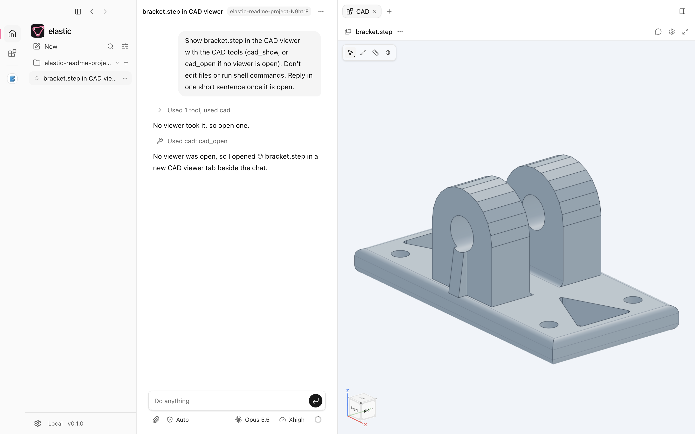
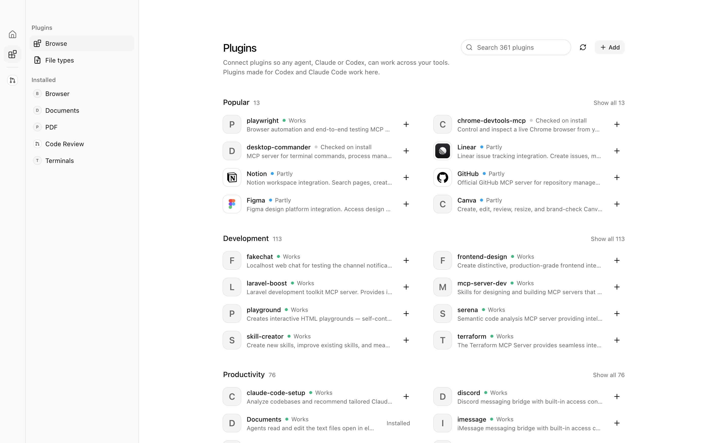
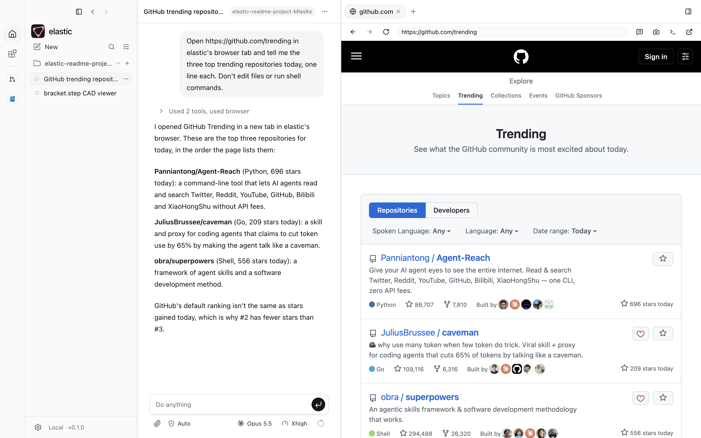
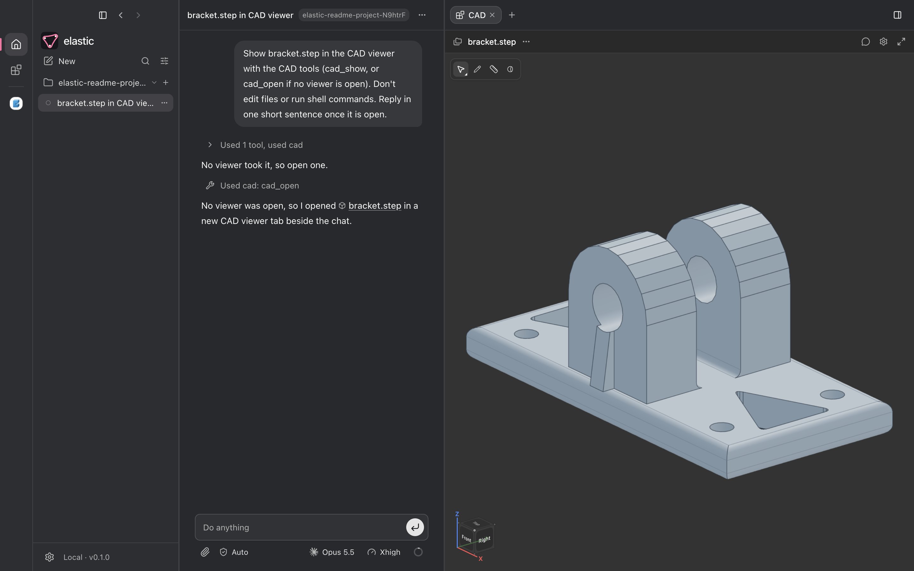
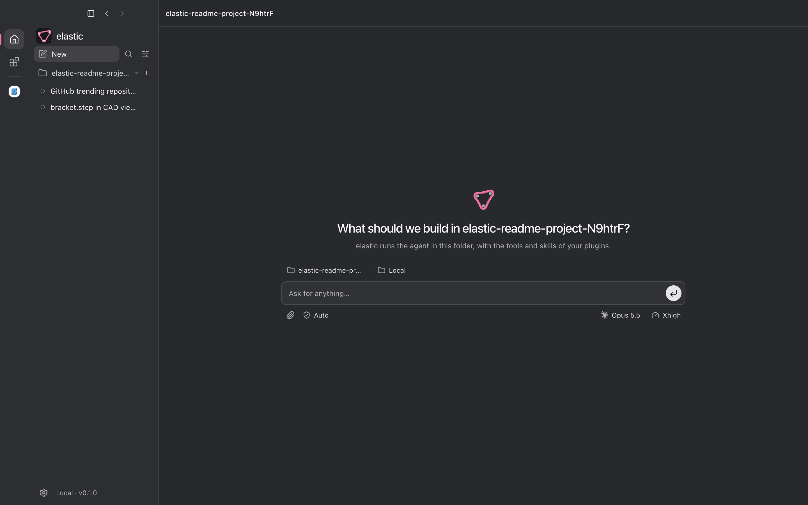
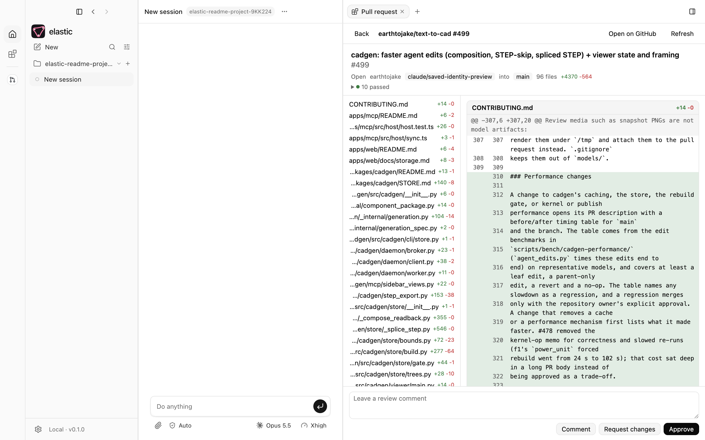
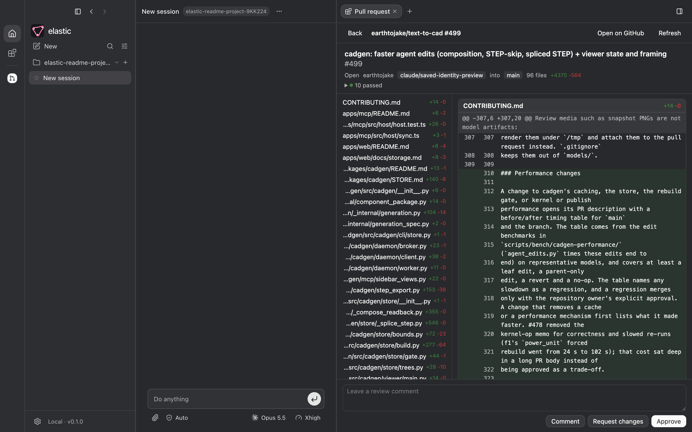
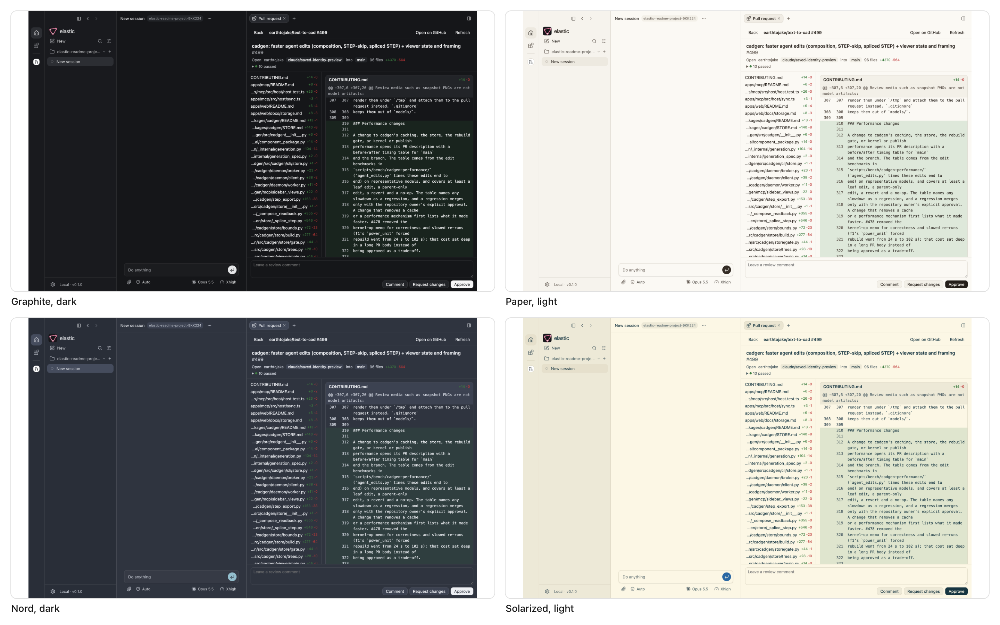

<p align="center">
  <picture>
    <source media="(prefers-color-scheme: dark)" srcset="resources/brand/elastic-wordmark-dark@2x.png">
    
  </picture>
</p>

<p align="center"><b>A Codex-style desktop agent app: any model, any plugin.</b></p>

<p align="center">
  
</p>

A desktop app for coding agents (Claude Code, Codex and others over the Agent
Client Protocol) where everything beyond the chat is a plugin. The core stays
small: projects and sessions, an explorer of tabs (files, review, browser,
terminal), git worktrees. Plugins add the rest as MCP servers, skills and MCP
App views, in the same format Codex and Claude Code use, so any model and any
plugin can plug in.

It started as the text-to-cad desktop app with the hardware parts taken out.
CAD is back as a plugin: text-to-cad installs from its own marketplace,
unchanged, the same plugin Codex runs.

## What it looks like

Every screenshot is the built app on a fresh profile with real output: the
plugins were installed from their marketplaces, and the chats are real Claude
turns (`tests/e2e/readme-shots.spec.ts`).

| | |
| --- | --- |
|  |  |
| **One store** over Claude Code's and Codex's marketplaces and text-to-cad's, the same plugin once. | **Browser**: Claude reads a public GitHub page in elastic's own browser tab, through the bundled Browser plugin. |
|  |  |
| **CAD** from text-to-cad, installed from GitHub unchanged, in dark mode. | **A new session**: pick a project, a model (Claude, Codex or any ACP agent), and go. |
|  |  |
| **Code Review**, a bundled MCP App over your own `gh`: a repository's pull requests, the diff, review comments. | The same pull request in dark mode. |

**Themes.** Light, dark or follow the system, and a colour theme on top:
Default, Graphite, Paper, Nord, Solarized and High contrast (Settings ›
Appearance). Plugin views pick the theme up live.



<!-- TODO(Amy): a Linear or Notion shot needs a signed-in account; sign in from Plugins and re-run the spec with that case added. -->

## Run it

```sh
npm install
npm run dev          # the app, with hot reload
npm run build        # out/ (skills, main, preload, renderer, the app's MCP server)
```

The renderer and main unit suites need Node 24 (`node:sqlite`, `Set.union`):

```sh
npm run typecheck
npm run lint
npx vitest run --project node --project renderer
npm run e2e          # Playwright against the built app
```

## Plugins

Rail › Plugins lists what is installed and what the marketplaces offer. The
app ships an examples marketplace (`resources/plugins/`): Tables (opens CSV
files, a rail page, a skill), the reference filesystem and memory servers, and
the MCP Apps demo. Add your own folder or marketplace from Add.

Code Review comes built in: the pull requests waiting on you on a rail page, and
any pull request in a tab with its checks, diff, comment threads and review
buttons, through your own GitHub CLI sign-in (`gh auth login`).

- How to write one, and how the pieces fit: [docs/plugins.md](docs/plugins.md)
- What Codex does, which this copies: a study of the Codex app's plugin format and UX, kept in a
  separate private research repository

## More

- [docs/design.md](docs/design.md): the long-form design notes (layout,
  keyboard, explorer, ACP, git, packaging, checks)
- [docs/integrations.md](docs/integrations.md): the app's own MCP server and
  what agents can do in the window
- [AGENTS.md](AGENTS.md): conventions for agents working in this repo
